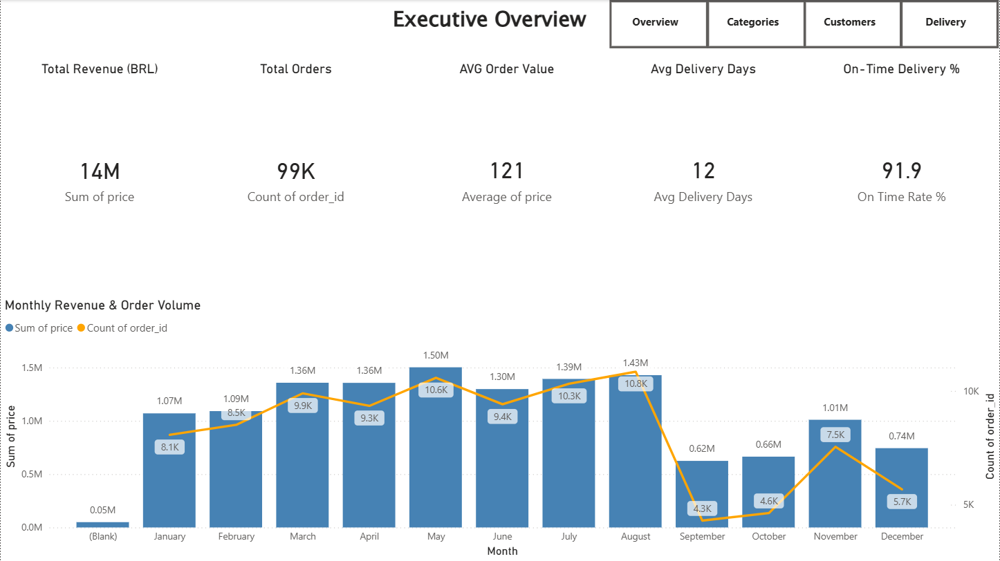
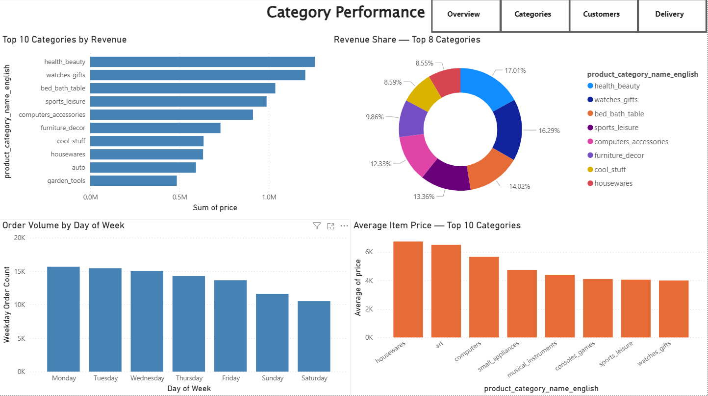
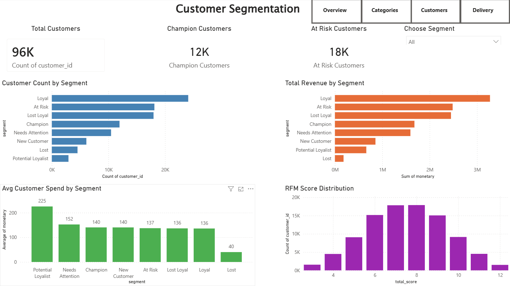
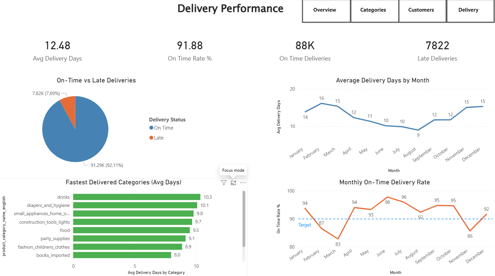

# RetailOps 360

An end-to-end retail analytics project analysing 100,000+ real e-commerce orders using **SQL**, **Python**, and **Power BI** — covering demand trends, customer segmentation, delivery performance, and category analysis.

---

## Dataset

**Brazilian E-Commerce Public Dataset by Olist** — [Kaggle](https://www.kaggle.com/datasets/olistbr/brazilian-ecommerce)

| Detail | Info |
|---|---|
| Orders | ~100,000 |
| Date Range | January 2017 – September 2018 |
| Tables Used | 7 relational tables |
| Filter Applied | Jan 2017 – Sep 2018 (partial boundary months excluded for clean trend analysis) |

---

## Project Structure

### 🗄️ SQL Analysis — MS SQL Server

| File | Description |
|---|---|
| `01_data_exploration.sql` | Monthly revenue and order volume trends |
| `02_sales_analysis.sql` | Category revenue, peak revenue days, weekday order patterns |
| `03_basket_analysis.sql` | Basket size, multi-item rate, co-purchase category analysis |
| `04_kpi_summary.sql` | Business KPIs, delivery performance, customer satisfaction, revenue growth rate |

### 🐍 Python Analysis — Jupyter Notebook

| Notebook | Description |
|---|---|
| `demand_forecasting.ipynb` | Monthly revenue trends, category performance, delivery analysis, weekday patterns |
| `customer_segmentation.ipynb` | RFM customer segmentation — Champions, Loyal, At Risk, Lost, and more |

### 📊 Dashboard — Power BI

Four-page interactive dashboard covering executive KPIs, category performance, customer segmentation, and delivery operations.

---

## Dashboard Preview

### Page 1 — Executive Overview

### Page 2 — Category Performance

### Page 3 — Customer Segmentation

### Page 4 — Delivery Performance

---

## Questions This Analysis Answers

### 📈 Revenue & Demand
**Q: How did revenue grow over the analysis period?**
Revenue grew approximately 7x from January 2017 to November 2017, driven by rapid platform adoption. Growth stabilised through 2018 at a consistently high monthly revenue level, indicating market maturation.

**Q: When was the highest sales period?**
November 2017 was the peak month for both revenue and order volume, aligning with Black Friday — the single largest demand spike in the dataset.

**Q: Which days of the week see the highest order volumes?**
Weekdays consistently outperform weekends, with Monday through Wednesday showing the strongest order volumes. This suggests B2C purchasing behaviour driven by post-weekend intent.

---

### 🛍️ Product & Category
**Q: Which product categories generate the most revenue?**
Health & Beauty and Watches & Gifts are the top two revenue-generating categories, together accounting for a significant share of total platform revenue.

**Q: Which categories command the highest average item price?**
Computers, small appliances, and musical instruments have the highest average item prices — indicating premium product segments with lower volume but higher value per transaction.

**Q: How concentrated is revenue across categories?**
Revenue is moderately concentrated — the top 8 categories account for the majority of total platform revenue, with a long tail of smaller categories contributing the remainder.

---

### 🛒 Basket & Purchase Behaviour
**Q: How many items do customers typically buy per order?**
The majority of orders contain a single item, indicating low cross-sell rates on the platform. Multi-item orders represent a minority but carry significantly higher basket values.

**Q: Which product categories are most frequently bought together?**
Co-purchase analysis reveals that categories within the same lifestyle segment (e.g. home & living items) appear together most frequently — suggesting bundling and recommendation opportunities.

---

### 👥 Customer Segmentation (RFM)
**Q: What does the customer base look like?**
96,000+ unique customers were segmented using RFM scoring. The largest segments are Loyal customers and At Risk customers — meaning retention is both the biggest opportunity and the biggest challenge.

**Q: Who are the most valuable customers?**
Champion customers (12K) show the highest recency, frequency, and monetary scores. Potential Loyalists show the highest average spend per order (R$225) despite lower frequency — a high-value target segment for re-engagement.

**Q: Which customers need immediate attention?**
18K customers are classified as At Risk — they were previously active but have not purchased recently. This segment represents significant recoverable revenue if targeted with re-engagement campaigns.

---

### 🚚 Delivery Performance
**Q: How fast are orders delivered on average?**
The average delivery time is 12 days from order placement to customer receipt — with significant variation across product categories.

**Q: How reliable is the delivery network?**
91.9% of orders are delivered on or before the estimated delivery date, indicating a strong but not perfect fulfilment operation with room for improvement in the remaining 8.1%.

**Q: Has delivery performance changed over time?**
Monthly on-time delivery rate trends show fluctuations tied to demand spikes — peak demand months (e.g. November 2017) correlate with slight dips in on-time performance, suggesting capacity constraints during high-volume periods.

---

## Key Insights Summary

- Revenue grew **~7x** from January to November 2017 before stabilising
- **November 2017** peak aligns with Black Friday — highest order volume in the dataset
- **Health & Beauty** and **Watches & Gifts** are the top revenue-generating categories
- **91.9% on-time delivery rate** with an average of **12 days** per order
- **18K At Risk customers** represent the largest recoverable revenue opportunity
- **Potential Loyalists** spend the most per order on average (**R$225**) — high-value re-engagement target
- Most orders contain a **single item** — significant cross-sell and bundling opportunity exists

---

## Tools & Stack

| Layer | Tool |
|---|---|
| Data Storage & Querying | MS SQL Server |
| Analysis & Visualisation | Python, Pandas, Matplotlib, Jupyter |
| Dashboard & Reporting | Power BI |
| Version Control | Git, GitHub |

---

## Status

✅ **Complete**

---

## Author

**Mohammad Ali Rafique**
[LinkedIn](https://linkedin.com/in/mohammad-ali-rafique) | [GitHub](https://github.com/alirafique026)
